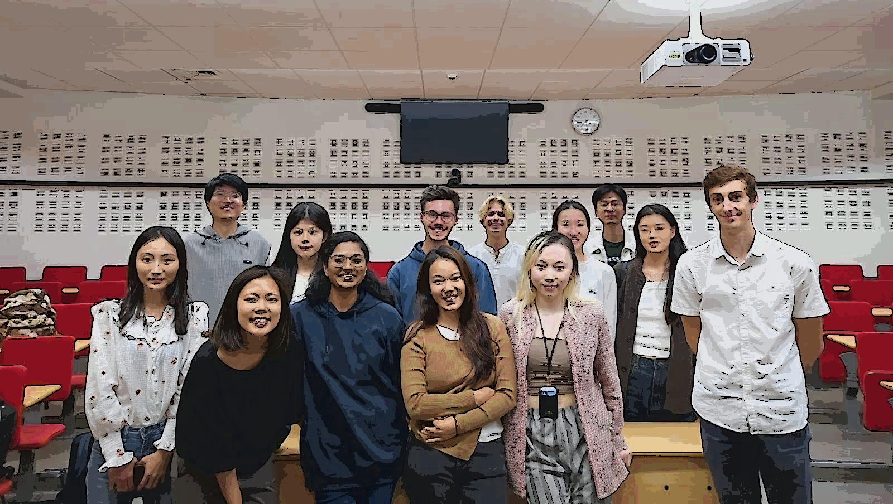

# Refresher Maths 2023
## Master Data Science and Buisness Analyctics @ ESSEC - CentraleSupélec

Sources for the refresher maths course taught at the ESSEC buisness school september 2023.

The content for the first two sessions can be found here:
https://github.com/pauldubois98/RefresherMaths2023/blob/main/FirstTwoSessions.pdf

After discussion with the students, the content had to evolve to better fit their needs.
Hence, the last six sessions are exercise based.

The exercises can be found here:
- Exercises Set 1 (Optimization):
https://github.com/pauldubois98/RefresherMaths2023/blob/main/ExercisesSet1/ExercisesOptimization.pdf  
Solutions:
https://github.com/pauldubois98/RefresherMaths2023/blob/main/Solutions/ExercicesSet1-solutions.pdf
- Exercises Set 2 (Linear Algebra):
https://github.com/pauldubois98/RefresherMaths2023/blob/main/ExercisesSet2/ExercisesLinearAlgebra.pdf  
Solutions:
https://github.com/pauldubois98/RefresherMaths2023/blob/main/Solutions/ExercicesSet2-solutions.pdf
- Exercises Set 3 (Calculus):
https://github.com/pauldubois98/RefresherMaths2023/blob/main/ExercisesSet3/ExercisesCalculus.pdf  
Solutions:
https://github.com/pauldubois98/RefresherMaths2023/blob/main/Solutions/ExercisesSet3-solutions.pdf
- Exercises Set 4 (Partial Differential Equations):
https://github.com/pauldubois98/RefresherMaths2023/blob/main/ExercisesSet4/ExercisesPDE.pdf  
Solutions:
https://github.com/pauldubois98/RefresherMaths2023/blob/main/Solutions/ExercisesSet4-solutions.pdf
- Exercises Set 5 (Principal Component Analysis):
https://github.com/pauldubois98/RefresherMaths2023/blob/main/ExercisesSet5/ExercisesPCA.pdf 
Solutions:
https://github.com/pauldubois98/RefresherMaths2023/blob/main/Solutions/ExercisesSet5-solutions.pdf 
Notebook:
https://github.com/pauldubois98/RefresherMaths2023/blob/main/ExercisesSet5/ExercisesPCA.ipynb  
Notebook solutions:
https://github.com/pauldubois98/RefresherMaths2023/blob/main/ExercisesSet5/ExercisesPCA_solutions.ipynb
- Exercises Set 6 (Binary Classification):
https://github.com/pauldubois98/RefresherMaths2023/blob/main/ExercisesSet6/ExercisesBinaryClassification.pdf

